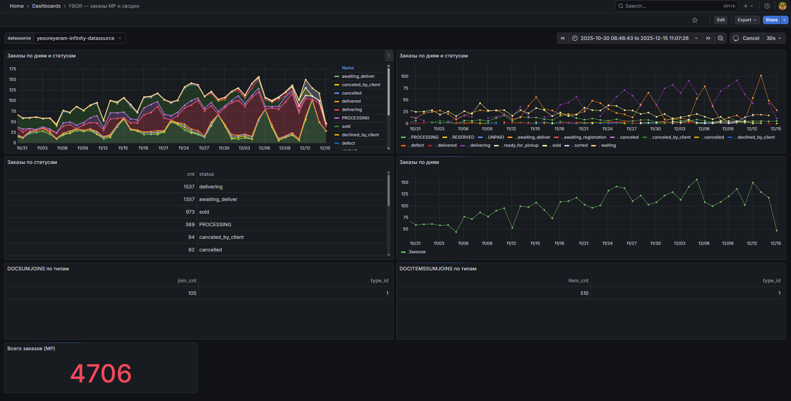

# FBGR — визуализация данных Firebird в Grafana

Веб-приложение на Django: чтение данных из базы Firebird 2.5 и отдача в Grafana через REST API для графиков, таблиц и фильтрации.


## Требования

- Python 3.10+
- Firebird 2.5 (сервер или Embedded)
- Grafana (для дашбордов)

## Установка

### 1. Python и зависимости

```bash
python -m venv .venv
.venv\Scripts\activate   # Windows
pip install -r requirements.txt
```

### 2. Переменные окружения

Скопируйте `.env.example` в `.env` и при необходимости измените значения:

```
# .env
DJANGO_SECRET_KEY=dev-key-change-in-production
DJANGO_DEBUG=1
DJANGO_ALLOWED_HOSTS=localhost,127.0.0.1

FIREBIRD_DB_PATH=mz.fb
FIREBIRD_USER=SYSDBA
FIREBIRD_PASSWORD=masterkey
```

Файл `.env` не коммитится в git. Для продакшена задайте переменные в окружении или в `.env` на сервере.

### 3. Firebird

- Установите [Firebird 2.5](https://firebirdsql.org/en/firebird-2-5/). Разрядность должна совпадать с Python (иначе возможна ошибка WinError 193).
- Файл БД `mz.fb` — в корне проекта или путь в `FIREBIRD_DB_PATH` в `.env`.

### 4. Запуск приложения

```bash
python manage.py runserver
```

API: http://127.0.0.1:8000/api/

### 5. Grafana

- Установите [Grafana](https://grafana.com/grafana/download) и плагин **Infinity** (Data source для JSON API).
- Добавьте источник данных **Infinity** с URL `http://127.0.0.1:8000` (или ваш хост).

## API

| Метод | URL | Описание |
|-------|-----|----------|
| GET | `/api/health/` | Проверка API и БД |
| GET | `/api/mp/orders/count/` | Количество заказов MP за период |
| GET | `/api/mp/orders/count/value/` | Одно значение для панели Stat |
| GET | `/api/mp/orders/by_status/` | Заказы по статусам за период |
| GET | `/api/mp/orders/by_day/` | Заказы по дням |
| GET | `/api/mp/orders/status_by_day/` | Заказы по дням и статусам |
| GET | `/api/mp/docsumjoins/summary/` | Сводка DOCSUMJOINS по типам |
| GET | `/api/mp/docsumjoins/by_day/` | DOCSUMJOINS по дням |
| GET | `/api/mp/docitemssumjoins/summary/` | Сводка DOCITEMSSUMJOINS по типам |
| GET | `/api/mp/docitemssumjoins/by_day/` | DOCITEMSSUMJOINS по дням |
| GET | `/api/mp/ozon_goods/count/` | Количество записей MP_OZON_GOODS_EX |
| GET | `/api/mp/ozon_goods/by_flags/` | Группировка по флагам (архив, скидка, FBO/FBS) |
| GET | `/api/mp/ozon_goods/by_day/` | Записей по дням |
| GET | `/api/mp/ozon_goods/quant_by_day/` | Суммы QUANT_FBS/QUANT_FBO по дням |
| GET | `/api/mp/ozon_goods/list/` | Список записей (до 500) |

Параметры эндпоинтов MP: `dt_from`, `dt_to` (YYYY-MM-DD). Для `mp/orders/count/` и `mp/orders/count/value/` дополнительно: `status`.

## Использование в Grafana

1. Добавьте источник **Infinity** с URL вашего API.
2. Импортируйте дашборды из каталога `grafana/dashboards/` или настройте provisioning (см. ниже).

### Пример итоговой визуализации

Дашборд **«FBGR — заказы MP и сводки»** (источник: Infinity, период задаётся в Grafana):

- **Всего заказов (MP)** — одно значение за выбранный период.
- **Заказы по дням** — график общего количества заказов по дням.
- **Заказы по статусам** — таблица: статус и количество (delivering, awaiting_deliver, sold, PROCESSING и др.).
- **Заказы по дням и статусам** — графики по дням с разбивкой по статусам (area или line).
- **DOCSUMJOINS по типам** — таблица по типам (type_id, join_cnt).
- **DOCITEMSSUMJOINS по типам** — таблица по типам (type_id, item_cnt).



### Provisioning (источники и дашборды)

- **Источники:** скопируйте `grafana/provisioning/datasources/` в каталог provisioning Grafana. В `fbgr-api.yml` укажите `url` (например `http://localhost:8000`). Установите плагин: `grafana-cli plugins install yesoreyeram-infinity-datasource`.
- **Дашборды:** в `grafana/provisioning/dashboards/dashboards.yml` укажите `path` на каталог с JSON. Доступны:
  - **fbgr-mp-orders.json** — заказы MP_ORDERS, DOCSUMJOINS, DOCITEMSSUMJOINS.
  - **fbgr-ozon-goods.json** — таблица MP_OZON_GOODS_EX: количество, по дням, FBS/FBO по дням, по флагам, список записей.

Настройки дашбордов хранятся в этих JSON-файлах; после изменений в Grafana экспортируйте дашборд в JSON и сохраните файл.

### Настройка через Grafana API

Скрипт `scripts/grafana_setup.py` создаёт источник данных **FBGR-API** в Grafana. Запуск (Grafana должна быть запущена):

```bash
set GRAFANA_URL=http://localhost:3000
set GRAFANA_API_KEY=ваш_ключ
set FBGR_API_URL=http://127.0.0.1:8000
python scripts/grafana_setup.py
```

### WinError 193 при подключении к БД

Ошибка связана с разрядностью: установите Firebird той же разрядности, что и Python, и при необходимости добавьте каталог с fbclient.dll в PATH.

## Структура проекта

```
fbgr/
  .env.example   — пример переменных окружения
  .env           — локальные переменные (не в git)
  config/        — настройки Django
  api/            — приложение: Firebird, запросы, REST
  api/utils.py    — форматирование чисел, сериализация
  api/queries_mp.py, views_mp.py   — MP_ORDERS, DOCSUMJOINS, DOCITEMSSUMJOINS
  api/queries_ozon.py, views_ozon.py — MP_OZON_GOODS_EX
  grafana/        — provisioning и JSON дашбордов
  scripts/        — grafana_setup.py
  manage.py
  requirements.txt
```
